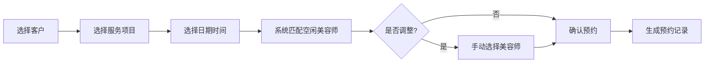
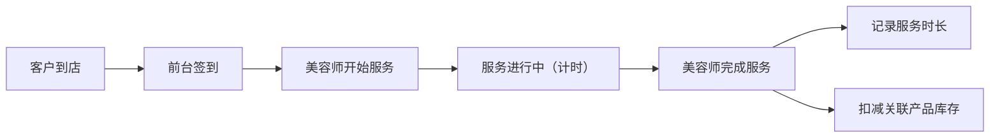

## 1. 产品概述
面向小型美容院的一体化管理工具，解决预约混乱、库存不清、服务流程无记录、经营数据缺失等痛点。
- 核心目标：提升美容院运营效率，实现预约自动化、库存精细化、服务流程化、数据可视化
- 目标用户：美容院老板及前台接待人员

## 2. 核心功能

### 2.1 用户角色
| 角色 | 登录方式 | 核心权限 |
|------|----------|----------|
| 管理员/老板 | 账号密码登录 | 全部功能权限，数据统计，系统设置 |
| 前台接待 | 账号密码登录 | 预约管理，客户签到，库存查询 |
| 美容师 | 账号密码登录 | 查看个人排班，开始/完成服务，个人业绩 |

### 2.2 功能模块
1. **工作台首页**：今日预约概览、待办提醒（生日客户、低库存）、关键数据指标
2. **预约管理**：预约列表、新建预约、预约详情、预约状态跟踪
3. **客户管理**：客户档案、客户列表、生日提醒、优惠券管理
4. **服务项目**：项目列表、项目设置（名称、时长、价格、关联产品）
5. **美容师管理**：美容师列表、排班设置、服务擅长项目
6. **库存管理**：产品列表、入库/出库记录、低库存预警
7. **服务流程**：签到、开始服务、完成服务、服务记录
8. **数据统计**：项目受欢迎度、美容师指定率、月度营收趋势

### 2.3 页面详情
| 页面名称 | 模块名称 | 功能描述 |
|----------|----------|----------|
| 工作台首页 | 数据概览卡片 | 今日预约数、待签到、服务中、已完成四项指标 |
| 工作台首页 | 今日预约时间线 | 按时间顺序展示今日所有预约 |
| 工作台首页 | 提醒区域 | 即将生日客户、低库存产品预警列表 |
| 预约管理 | 预约列表 | 支持按日期、状态、美容师筛选，展示预约卡片 |
| 预约管理 | 新建预约弹窗 | 选择客户/新客户、选择项目、选择日期时间、自动匹配空闲美容师 |
| 预约管理 | 预约详情 | 展示客户信息、项目信息、美容师、状态流转按钮 |
| 客户管理 | 客户列表 | 客户档案卡片，支持搜索，显示基本信息和历史消费 |
| 客户管理 | 客户详情 | 个人信息、消费记录、优惠券记录、生日提醒设置 |
| 服务项目 | 项目列表 | 分类展示（面部/身体/美甲/脱毛），显示项目名称、时长、价格 |
| 服务项目 | 项目编辑 | 设置项目基本信息、关联消耗产品及用量 |
| 美容师管理 | 美容师列表 | 展示头像、姓名、擅长项目、今日排班状态 |
| 美容师管理 | 排班设置 | 设置美容师工作时间、休息日 |
| 库存管理 | 产品列表 | 展示产品库存、单位、预警阈值、状态标签 |
| 库存管理 | 库存操作 | 入库登记、出库记录列表 |
| 服务流程 | 签到面板 | 客户到店签到，更新预约状态 |
| 服务流程 | 服务操作 | 美容师点击开始服务、完成服务，自动记录时长并扣减库存 |
| 数据统计 | 项目统计 | 月度项目预约量柱状图，排序展示 |
| 数据统计 | 美容师统计 | 美容师指定率排行、服务完成数统计 |
| 数据统计 | 营收统计 | 月度营收趋势折线图 |

## 3. 核心流程

### 3.1 预约流程
前台接待创建预约 → 选择服务项目 → 选择日期时间 → 系统自动匹配空闲美容师（可手动调整）→ 确认预约 → 系统生成预约记录

### 3.2 服务流程
客户到店 → 前台签到 → 美容师点击开始服务（记录开始时间）→ 服务完成 → 美容师点击完成（记录结束时间，自动扣减产品库存）

### 3.3 库存管理流程
设置产品预警阈值 → 每次服务完成自动扣减库存 → 库存低于阈值触发预警 → 提醒进货 → 入库登记更新库存

## 4. 用户界面设计

### 4.1 设计风格
- **主色调**：玫瑰粉 #E8B4B8 作为主色，传递温馨柔美
- **辅助色**：暖金色 #D4A574 点缀，营造高端感
- **背景色**：奶油白 #FDF8F5 主背景，浅粉灰 #F5EAEA 卡片背景
- **文字色**：深棕 #3D2C2E 主文字，灰棕 #7A6567 次要文字
- **按钮风格**：圆角矩形（12px），渐变填充，柔和阴影
- **字体**：标题使用"思源宋体"优雅大气，正文使用"思源黑体"清晰易读
- **布局风格**：左侧导航栏 + 右侧内容区，卡片式布局，柔和圆角，大量留白
- **图标风格**：线性图标，柔和线条，点缀暖色填充

### 4.2 页面设计概览
| 页面名称 | 模块名称 | UI元素 |
|----------|----------|--------|
| 工作台首页 | 数据概览卡片 | 渐变背景卡片、大号数字指标、图标装饰、悬浮动效 |
| 工作台首页 | 今日时间线 | 垂直时间轴、状态彩色标签、圆形时间节点 |
| 工作台首页 | 提醒区域 | 粉/金色警示图标、动画呼吸效果、快捷操作按钮 |
| 预约管理 | 预约列表 | 卡片网格布局、头像+状态标签、悬停展开详情 |
| 预约管理 | 新建预约弹窗 | 分步表单、进度指示、日期时间选择器、美容师可选项高亮 |
| 客户管理 | 客户列表 | 头像卡片、消费等级徽章、生日蛋糕图标提示 |
| 库存管理 | 产品列表 | 库存进度条、低库存红色高亮、状态标签动画 |
| 数据统计 | 图表区域 | 柔和渐变柱状图/折线图、金色数据标注、卡片阴影层次 |

### 4.3 响应式
- 桌面端优先设计（最小宽度 1280px）
- 平板端（768px-1279px）：导航栏折叠为图标模式
- 移动端（<768px）：底部Tab导航，内容区单列布局，触摸优化

### 4.4 动效设计
- 页面加载：元素依次淡入上浮（stagger 100ms）
- 按钮交互：悬停时轻微上浮 + 阴影加深，点击时缩放反馈
- 状态变更：服务状态切换时卡片边框颜色渐变过渡
- 数据刷新：数字滚动动画
- 提醒标记：低库存、生日提醒使用柔和呼吸灯效果
