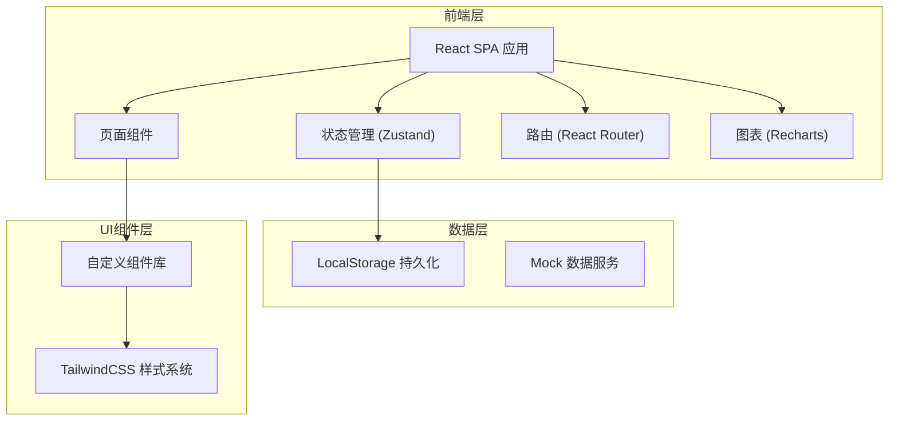
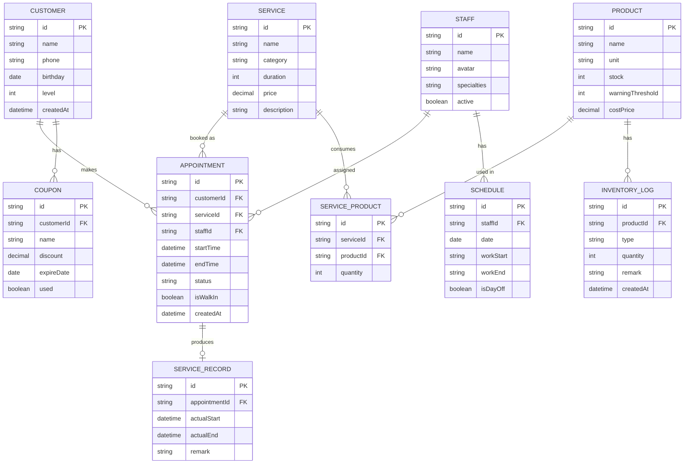

## 1. 架构设计



## 2. 技术描述
- **前端框架**：React@18 + TypeScript
- **构建工具**：Vite@5
- **样式方案**：TailwindCSS@3
- **状态管理**：Zustand（轻量级状态管理）
- **路由管理**：React Router@6
- **图表库**：Recharts
- **图标库**：Lucide React
- **日期处理**：date-fns
- **数据持久化**：LocalStorage（本地存储模拟后端）
- **初始化方式**：npm create vite@latest

## 3. 路由定义
| 路由路径 | 页面名称 | 功能说明 |
|----------|----------|----------|
| /dashboard | 工作台首页 | 今日数据概览、预约时间线、提醒中心 |
| /appointments | 预约管理 | 预约列表、筛选、新建/编辑预约 |
| /customers | 客户管理 | 客户列表、客户档案、生日提醒 |
| /services | 服务项目 | 项目列表、项目设置、关联产品 |
| /staff | 美容师管理 | 美容师列表、排班设置 |
| /inventory | 库存管理 | 产品列表、入库/出库、库存预警 |
| /statistics | 数据统计 | 项目统计、美容师排行、营收趋势 |

## 4. 数据模型

### 4.1 ER图



### 4.2 核心数据类型定义

```typescript
// 客户
interface Customer {
  id: string;
  name: string;
  phone: string;
  birthday: string;
  level: 1 | 2 | 3;
  createdAt: string;
}

// 服务项目
interface Service {
  id: string;
  name: string;
  category: 'facial' | 'body' | 'nail' | 'hair_removal';
  duration: 30 | 60 | 90;
  price: number;
  description: string;
  products: { productId: string; quantity: number }[];
}

// 美容师
interface Staff {
  id: string;
  name: string;
  avatar: string;
  specialties: string[];
  active: boolean;
}

// 排班
interface Schedule {
  id: string;
  staffId: string;
  date: string;
  workStart: string;
  workEnd: string;
  isDayOff: boolean;
}

// 预约
type AppointmentStatus = 'pending' | 'checked_in' | 'in_service' | 'completed' | 'cancelled';

interface Appointment {
  id: string;
  customerId: string;
  serviceId: string;
  staffId: string;
  startTime: string;
  endTime: string;
  status: AppointmentStatus;
  isWalkIn: boolean;
  createdAt: string;
}

// 服务记录
interface ServiceRecord {
  id: string;
  appointmentId: string;
  actualStart: string;
  actualEnd: string;
  remark: string;
}

// 产品
interface Product {
  id: string;
  name: string;
  unit: string;
  stock: number;
  warningThreshold: number;
  costPrice: number;
}

// 库存日志
type InventoryLogType = 'in' | 'out' | 'consume';

interface InventoryLog {
  id: string;
  productId: string;
  type: InventoryLogType;
  quantity: number;
  remark: string;
  createdAt: string;
}

// 优惠券
interface Coupon {
  id: string;
  customerId: string;
  name: string;
  discount: number;
  expireDate: string;
  used: boolean;
}
```

## 5. 核心模块设计

### 5.1 目录结构
```
src/
├── components/         # 通用组件
│   ├── Layout/        # 布局组件
│   ├── Card/          # 卡片组件
│   ├── Modal/         # 弹窗组件
│   ├── StatusTag/     # 状态标签
│   └── Timeline/      # 时间线
├── pages/             # 页面
│   ├── Dashboard/
│   ├── Appointments/
│   ├── Customers/
│   ├── Services/
│   ├── Staff/
│   ├── Inventory/
│   └── Statistics/
├── store/             # 状态管理
│   ├── appointmentStore.ts
│   ├── customerStore.ts
│   ├── serviceStore.ts
│   ├── staffStore.ts
│   ├── inventoryStore.ts
│   └── statisticsStore.ts
├── utils/             # 工具函数
│   ├── date.ts
│   ├── storage.ts
│   ├── matching.ts    # 美容师匹配算法
│   └── mockData.ts
├── types/             # TypeScript类型
│   └── index.ts
└── App.tsx
```

### 5.2 美容师智能匹配算法
1. 输入：服务项目ID、预约日期时间
2. 步骤：
   - 获取该时段排班在班的美容师
   - 检查美容师在该时间段是否已有预约（排除时间冲突）
   - 按美容师擅长项目匹配度排序
   - 按当日已分配预约数升序排序（负载均衡）
   - 返回最佳匹配的美容师列表

### 5.3 库存扣减机制
- 触发时机：服务完成时（点击"完成服务"按钮）
- 执行逻辑：
  1. 根据服务ID查询关联产品及用量
  2. 逐一扣减对应产品库存
  3. 生成"consume"类型库存日志
  4. 检查扣减后库存是否低于预警阈值，是则触发低库存状态
